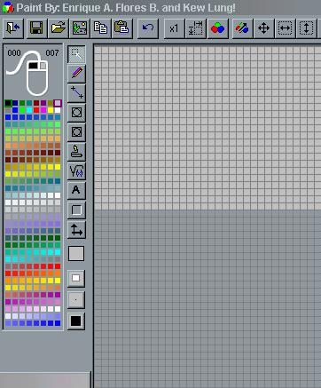



## Paint 256

### Description

This is a paint Program with lots and LOTS of features like Circles, Square, cut & paste and much more! SEE Screenshot! Votes Welcome!
 
### More Info
 

             |
---                |---
**Submitted On**   |2000-08-31 21:58:56
**By**             |[Enrique Flores](https://github.com/Planet-Source-Code/PSCIndex/blob/master/ByAuthor/enrique-flores.md)
**Level**          |Intermediate
**User Rating**    |4.4 (22 globes from 5 users)
**Compatibility**  |VB 5\.0, VB 6\.0
**Category**       |[Graphics](https://github.com/Planet-Source-Code/PSCIndex/blob/master/ByCategory/graphics__1-46.md)
**World**          |[Visual Basic](https://github.com/Planet-Source-Code/PSCIndex/blob/master/ByWorld/visual-basic.md)
**Archive File**   |[CODE\_UPLOAD9483912000\.zip](https://github.com/Planet-Source-Code/enrique-flores-paint-256__1-11145/archive/master.zip)

